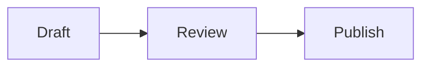
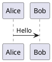

# MiaoYan

Create content for MiaoYan's actual Markdown and presentation surfaces. Prefer portable MiaoYan syntax over app-specific guesses or absolute local paths.

## Work from the requested surface

1. Identify whether the user needs a normal note, a PPT presentation, note organization, or a CLI operation.
2. Keep the user's language and desired tone. Do not translate content unless asked.
3. Preserve existing frontmatter, fenced code, inline code, math, links, wikilinks, and attachment paths when editing.
4. Use the supported patterns below. Fall back to standard GitHub Flavored Markdown when no MiaoYan-specific feature is needed.
5. Check the final Markdown for closed fences, valid paths, exact wikilink targets, and standalone PPT separators.

## Write MiaoYan Markdown

Use standard Markdown for headings, paragraphs, emphasis, links, images, blockquotes, ordered and unordered lists, code, and horizontal rules.

Use these supported extensions when they improve the content:

```markdown
| Item | Status |
|------|--------|
| Draft | Done |

- [ ] Follow up
- [x] Draft complete

~~Removed text~~

Text with a footnote.[^1]

[^1]: Footnote details.
```

Use fenced code with a language identifier:

````markdown
```swift
let title = "MiaoYan"
```
````

### Link notes with wikilinks

Link to another note by its exact title, without the `.md` suffix:

```markdown
See [[Project plan]] for the next steps.
```

Keep the target text aligned with the note title so MiaoYan can build backlinks. Do not invent alias, heading, or block-reference syntax.

### Add local images

Keep local attachments in an `i/` folder under the note's current MiaoYan folder and use the shared root-relative form:

```markdown

```

Prefer `/i/<filename>` over `file://` URLs or machine-specific absolute paths. Keep remote images as normal `https://` URLs.

When writing raw HTML for media, tables, or iframes, keep it responsive and avoid horizontal scrolling:

```html

```

### Add math and diagrams

Use `$...$` for inline math and `$$...$$` for display math:

```markdown
The result is $E = mc^2$.

$$
\sum_{i=1}^{n} i = \frac{n(n+1)}{2}
$$
```

Use the matching fenced language for each diagram:

````markdown




```markmap
# Topic
## Branch
- Detail
```
````

Do not wrap diagram fences in additional HTML.

### Add callouts and collapsible content

Use GitHub Alert markers for callouts:

```markdown
> [!NOTE]
> This is useful context.

> [!WARNING]
> Back up the folder before moving it.
```

Supported markers are `NOTE`, `TIP`, `IMPORTANT`, `WARNING`, and `CAUTION`.

Use native HTML for collapsible details:

```html
<details>
<summary>More details</summary>

Markdown content goes here.

</details>
```

### Preserve frontmatter

Keep leading YAML frontmatter at the very start of the note:

```markdown
---
date: 2026-07-24
tags:
  - notes
---
```

MiaoYan hides leading frontmatter in rendered output. Do not move it into the body or add frontmatter unless the user needs metadata.

## Create MiaoYan PPT presentations

Separate slides with `---` on its own line. Do not use a horizontal rule inside a slide because MiaoYan treats it as a slide boundary.

Start with this minimal structure:

```markdown
# Presentation title

Opening idea

---

## Second slide

- One point
- Another point
```

Use `Command + Option + P` to open PPT mode in MiaoYan.

### Configure Reveal.js only when needed

Place an optional HTML comment at the start of the presentation, after any YAML frontmatter:

```markdown
<!--
transition: slide
backgroundTransition: none
slideNumber: c/t
controls: true
progress: true
-->
```

Use Reveal.js keys only when the user asks for presentation behavior. Keep defaults otherwise.

### Use slide effects sparingly

Add slide backgrounds immediately before a slide heading:

```markdown
<!-- .slide: data-background="#F5F1E8" -->
## Context
```

Reveal points progressively with fragments:

```markdown
- First point <!-- .element: class="fragment" data-fragment-index="1" -->
- Second point <!-- .element: class="fragment" data-fragment-index="2" -->
```

Highlight code lines with Reveal.js line ranges:

````markdown
```swift [1|2-3|4]
struct Note {
    let title: String
    let body: String
}
```
````

Use raw HTML for a two-column slide only when the content truly needs columns:

```html
<div style="display: flex; gap: 2rem;">
  <div style="flex: 1;">Left content</div>
  <div style="flex: 1;">Right content</div>
</div>
```

Keep local PPT images in `/i/` just like normal notes. Avoid absolute `file://` paths so presentations stay portable when the library moves or syncs to another Mac.

## Use the `miao` CLI

Use only the commands that MiaoYan actually provides:

```bash
miao list [folder]
miao search <query>
miao cat <title|path>
miao open <title|path>
miao new <title> [text]
miao update
```

Use `miao list .` to include notes stored at the library root. Use an exact title or explicit path when duplicate note titles could exist.

Use `miao cat` to inspect a note and `miao open` to show it in the app. Use `miao new` only for new notes. The CLI does not provide an edit-existing command, so do not invent `miao edit`, `miao append`, or similar commands.

If the CLI cannot detect the library, use the user's configured MiaoYan folder through `MIAOYAN_PATH` for that command. Never guess a private folder or write outside the user-approved library.

## Final checks

- Keep note content as plain Markdown unless a supported extension is needed.
- Match wikilinks to real note titles.
- Keep local attachments under `i/` and reference them as `/i/<filename>`.
- Keep diagram and code fences balanced.
- Keep PPT `---` separators on their own lines.
- Avoid machine-specific paths and unsupported CLI commands.
- Preserve user content and metadata that were not part of the request.
